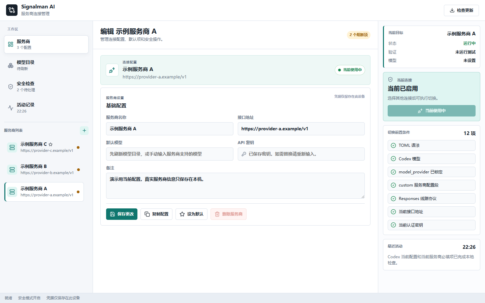

# Signalman AI

Windows 上的 Codex provider 管理工具。它把手工修改 `config.toml` 和 `auth.json` 变成一个可检查、可恢复的桌面流程：先确认目标服务商能完成真实请求，再创建恢复点，然后才切换。

> 截图使用离线示例配置生成，不包含真实服务商、地址、密钥或本机资料。

**当前状态：** 产品仍处于 alpha 阶段。首个 Microsoft Store 版本正在认证；在它通过并完成 Store 安装验收前，[GitHub Releases](https://github.com/ga626/codex-provider-switcher/releases/latest) 的 Latest 才是公开下载入口。源码分支和 PR 中的功能不等于已经交付给安装用户。

## 你打开它后会做什么

1. 保存 provider 的名称、接口地址、模型和 API 密钥；密钥只保存在当前 Windows 用户的本机资料中。
2. 运行“服务商可用性测试”，确认地址、密钥、模型和 Responses 协议能够完成一次真实短请求。
3. 测试通过后执行切换；应用先创建恢复点，再写入 Codex 配置。
4. 关闭并重新打开 Codex，在新会话里确认实际工作正常；需要回退时，从恢复中心还原最近备份。

## 它适合谁

- 你需要在多个兼容服务商之间切换，但不想手工编辑 Codex 配置文件。
- 你希望切换前先确认地址、密钥和模型能完成一次真实的 Responses 请求。
- 你希望每次写配置前都有恢复点，出问题时能回到上一次状态。

## 你会得到什么

| 能力 | 实际作用 |
| --- | --- |
| 服务商目录 | 新安装从空目录开始；每位用户只保存自己的 provider 配置，密钥不以明文留在本工具目录中。 |
| 模型目录 | 从服务商读取可见模型，避免把某个固定模型名当作通用默认值。 |
| 可用性测试 | 用当前模型发送短时 Responses 请求；认证、额度、模型、路径和网络问题会给出可理解的结果。 |
| 安全切换 | 未通过测试不写 Codex 配置；通过后先备份，再更新 `config.toml` 和 `auth.json`。 |
| 恢复与时间线 | 保留本工具创建的恢复点和不含凭据内容的活动记录。 |
| 更新 | 当前 GitHub 安装版可检查签名更新；首个 Store 版本认证后，Store 安装版将由 Microsoft Store 管理更新。用户不需要私钥、口令或发布配置。 |

可用性测试保证的是“当前地址、密钥和模型能完成最小真实请求”。它不能替代长上下文、工具调用或你自己的实际工作验收。

## 安装与更新

1. 打开 [最新发布版](https://github.com/ga626/codex-provider-switcher/releases/latest)。
2. 下载名称带 `setup.exe` 的 Windows 安装包及同名 `.sha256` 文件。
3. 从开始菜单或桌面图标启动 `Signalman AI`。

正常入口只打开一个应用窗口：不需要浏览器、不需要输入端口、不应留下 CMD 窗口。完整的安装、升级和卸载说明在 [安装与更新](docs/user/installation.zh.md)。从源码运行的开发版仅用于验收，不应替代已安装版本。

## 数据和安全边界

- provider API key 与本工具创建的敏感恢复副本使用当前 Windows 用户的 DPAPI 保护。
- 应用写入前会创建备份；不要用它在正在工作的同一个 Codex 会话中做最终 provider 切换。
- 不要把本机应用数据目录中的 profiles、备份或日志发送到公开 Issue。
- 应用不提供默认开机自启、托盘常驻或后台 daemon；关闭窗口即退出。
- 当前 GitHub 安装版的 updater 签名与 Windows 代码签名是两条独立安全链路。首个 Store 版本认证后，Store 的包签名和更新将由 Microsoft Store 管理。每个版本是否已经完成完整交付，以对应渠道的版本说明为准。

## 常见问题

### 为什么测试通过了，仍要在新 Codex 会话里确认？

测试只做最小真实请求，用来避免把明显不可用的配置写进去。实际工作还会受到上下文长度、工具调用、服务商策略和网络状态影响，所以最终确认必须在新会话完成。

### 为什么服务商余额不足时不能切换？

因为这代表当前密钥无法完成真实请求。继续写入该配置只会让 Codex 在切换后立即不可用。补足额度或配额后重新测试即可。

### 旧切换工具什么时候可以停？

先完成新版本下载、安装、启动、更新和真实服务商验收；再在新的 Codex 会话中运行只读交接预检并完成一次新工具切换。通过后才停止旧工具，旧目录先保留作回滚参考。详细条件见 [旧工具替换手册](docs/maintainers/legacy-cutover.zh.md)。

### 遇到问题怎么办？

先查看 [排错指南](docs/user/troubleshooting.zh.md)。提交 Issue 时只提供版本、操作步骤、脱敏错误摘要和时间，不要提交密钥、完整配置、profiles、备份或私有截图。

## 继续了解

- 使用软件：[安装、更新与卸载](docs/user/installation.zh.md) / [排错指南](docs/user/troubleshooting.zh.md)
- 隐私与支持：[隐私政策](docs/user/privacy-policy.zh.md) / [获取帮助](SUPPORT.md)
- 了解边界：[产品规格](docs/reference/product-spec.zh.md) / [安全说明](SECURITY.md)
- 参与开发：[贡献说明](CONTRIBUTING.md) / [开发与 PR 指南](docs/contributing/development-and-prs.zh.md)
- 维护发布：[发布与交付手册](docs/maintainers/release-and-delivery.zh.md) / [依赖与安全治理](docs/maintainers/dependency-security.zh.md)
- 查看历史：[变更记录](CHANGELOG.md) / [Release 页面](https://github.com/ga626/codex-provider-switcher/releases)

维护者：本项目由仓库维护者和贡献者共同维护。安全问题请按 [SECURITY.md](SECURITY.md) 的私密路径报告。
