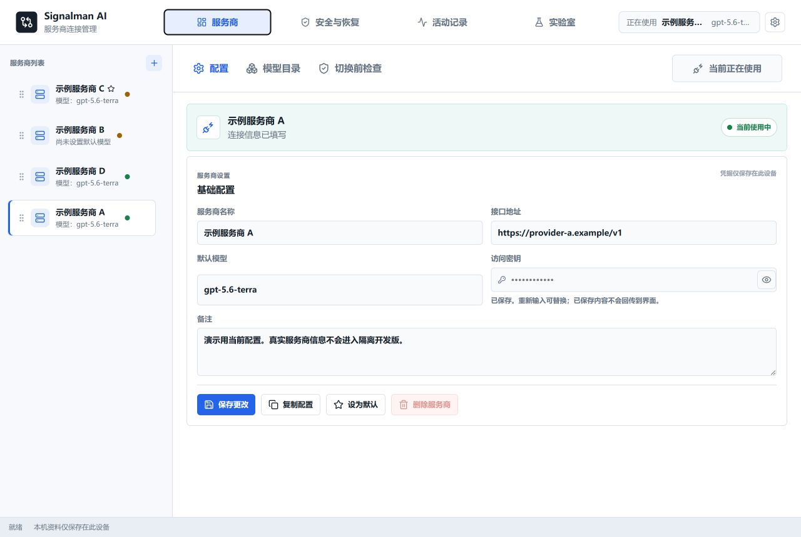
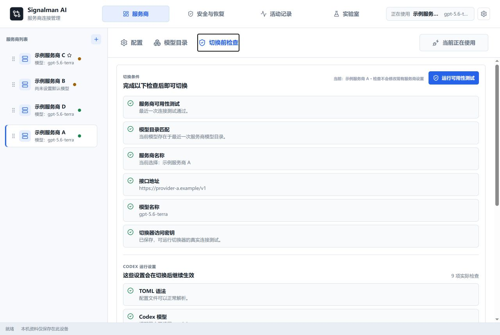
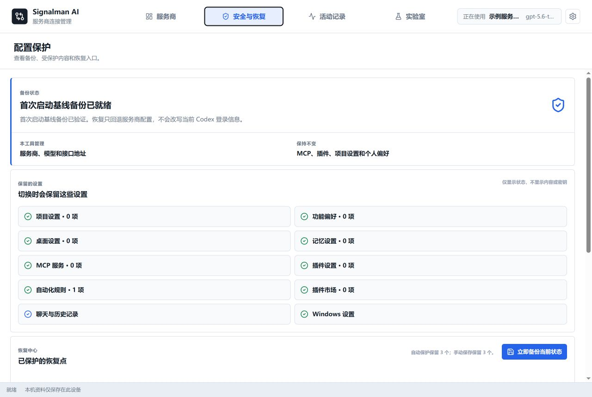
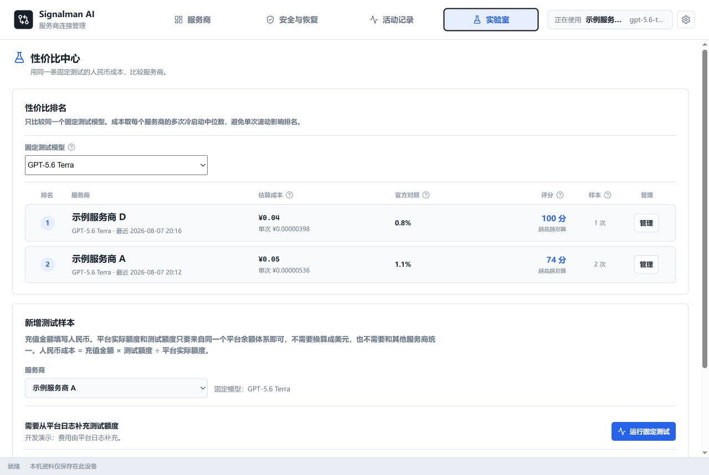

# Signalman AI

**安全切换 Codex provider，不悄悄覆盖你的工作环境。**

Signalman AI 是 Windows 上的本地桌面工具。它适合已经在 Codex 里配置了 MCP、插件、项目和个人工作习惯，却不想再手工编辑配置文件的用户。

它不会把“切换服务商”做成一次看不见的整文件覆盖：先检查目标服务商、让你看清将发生的变更、再由你确认；每次需要写入前都会创建恢复点。无法确认安全时，它会停止，而不是猜测或覆盖。

**当前为 alpha。** 适合知情的小范围试用；切换完成后，仍应在新的 Codex 会话里确认你的实际工作正常。

[下载最新 GitHub 版](https://github.com/ga626/codex-provider-switcher/releases/latest) · [查看首次使用流程](#第一次使用只要四步) · [遇到问题先看排错指南](docs/user/troubleshooting.zh.md)

> 本页截图对应 v0.10.6-alpha 的离线示例配置：不包含真实服务商、地址、密钥、本机路径或 Codex 内容，也不会连接任何服务商。实际界面会显示运行版本、渠道和构建标识。

## 你为什么会需要它

换 provider 本身并不复杂；真正让人不放心的是，某些工具会把旧的 `config.toml` 或 `auth.json` 整份覆盖回来，连同自己长期积累的 MCP、插件、项目设置和其他工作环境一起改掉。

Signalman AI 的目标不是替你更快地编辑文件，而是把这件高风险的小事变成一个能检查、能确认、也能安全回退的流程。

| 你关心的事 | Signalman AI 怎么做 |
| --- | --- |
| **先确认能不能用** | 对当前服务商、模型、地址和访问密钥运行一次最小真实请求。没有通过，就不允许切换，也不会写入 Codex 配置。 |
| **只改必要的部分** | 切换前显示检查结果和变更影响；确认时再次检查配置有没有被其他程序改动。不能安全确认时，直接停止。 |
| **出问题能回去** | 首次启动建立基线恢复点；每天首次打开自动备份，也可以随时手动备份。备份检查异常时仍会打开窗口并停止写入，恢复同样需要确认，不会整份覆盖你的现有工作环境。 |
| **比较哪个更划算** | 在“实验室 > 性价比中心”运行同一条固定测试，记录充值金额、平台实际额度和测试额度；它会换算出可横向比较的人民币成本与排名。 |

## 第一次使用只要四步

1. **安装并打开。** 第一次启动会尝试创建“首次启动基线备份”，不会切换服务商或改写 Codex 配置；若备份检查未完成，窗口仍会打开，但不会进入写入路径。
2. **添加服务商并选择模型。** 填写名称、接口地址、模型和访问密钥；资料保存在本机。
3. **运行可用性测试。** 它会检查当前服务商是否能完成一次最小真实请求；未通过时不会进入写入路径。
4. **查看检查结果后确认切换。** 完成后关闭当前 Codex 会话并重新打开，再确认你的实际工作；需要回退时，到“配置保护”选择恢复点。

测试只验证“当前地址、密钥和模型能完成最小请求”。它不能代替你的长上下文、工具调用、配额或第三方服务稳定性的实际使用确认。

## 它会改什么，又不会碰什么

| 内容 | 行为 |
| --- | --- |
| Codex 的 provider、模型和接口地址 | 只有你确认切换后才会更新；写入前会创建恢复点，并再次确认配置没有漂移。 |
| `config.toml`、`auth.json` 与环境变量中的认证状态 | 保留。当前未声明认证方式的 custom provider 不会要求或写入 `api_key`；登录或环境变量认证会停止自动切换，而不是猜测或覆盖。 |
| MCP、插件、项目、桌面设置、记忆、自动化规则和聊天/历史环境 | 不作为切换或恢复的覆盖目标。恢复只回退 Signalman AI 自己管理的 provider 字段。 |
| API key、配置、恢复副本和活动记录 | 不上传。切换器保存的敏感资料和恢复副本使用当前 Windows 用户的 DPAPI 保护。 |
| 你的最终使用结果 | 仍需要你在新的 Codex 会话里确认；任何工具都不能替第三方 provider 承诺余额、长期稳定性或所有高级能力。 |

恢复不是“把一份旧文件整份写回去”。如果 Signalman AI 发现 provider 字段已经被你或其他程序改过、无法证明自动回退安全，就会拒绝自动恢复并保留当前内容，交由你决定下一步。

## 用同一把尺子比较费用

“实验室 > 性价比中心”用于比较同一模型在不同服务商上的实际成本。先运行一条极短的固定测试：如果服务商响应中返回本次费用，应用会自动填入“测试额度”；没有返回时，按提示从该服务商的使用日志复制即可。再填写“充值金额”和“平台实际额度”，即可得到这次固定测试的人民币成本、官方成本占比和同模型排名。

它不读取你的账单、不自动充值，也不会因为测试而切换服务商或改写 Codex 配置。订阅制同样可以使用：把订阅价格和平台给出的固定额度填入对应字段；不同模型、不同测试记录不应混在同一排名中。

## 选择下载方式

| 你想要什么 | 选择 | 更新方式 |
| --- | --- | --- |
| 尽快使用已经公开交付的新功能 | [GitHub Releases](https://github.com/ga626/codex-provider-switcher/releases/latest) | 日常小版本优先在这里发布；应用内可以检查带签名的更新。 |
| 更省心、由微软管理更新 | [Microsoft Store](https://apps.microsoft.com/detail/9P7PGV62WKK6) | 只发布经过一段时间验证的稳定大版本，可能晚于 GitHub。 |

两条路径是同一个产品的不同交付节奏。一台电脑请选择其中一个作为日常入口，不要把开发版、维护者候选版、GitHub 安装版和 Store 安装版混在一起使用。

### GitHub 最新版

1. 打开[最新发布页](https://github.com/ga626/codex-provider-switcher/releases/latest)，确认页面标为 `Latest`，再下载名称带 `setup.exe` 的 Windows 安装包和同名 `.sha256` 文件。
2. 确认下载页属于本仓库、版本号与校验文件一致后再运行安装包。GitHub 通道尚未购买 Windows Authenticode 签名，Windows 可能显示 SmartScreen 提示；企业策略或 Smart App Control 也可能不允许继续。
3. 从开始菜单或桌面图标启动 `Signalman AI`。完整的安装、更新和卸载说明见[安装与更新](docs/user/installation.zh.md)。

### Microsoft Store 稳定版

1. 打开 [Microsoft Store 产品页](https://apps.microsoft.com/detail/9P7PGV62WKK6)，安装 `Signalman AI`。
2. 后续稳定更新由 Microsoft Store 检查和交付；Store 版本可能晚于 GitHub，这是刻意保持的双渠道节奏。

正常入口只打开一个应用窗口：不需要浏览器、不需要输入端口，也不应留下 CMD 窗口。源码运行的开发版只用于验收，不应替代已安装版本。

## 开机启动由你决定

默认关闭。需要时，在“应用设置”中主动开启“开机后自动打开”；Signalman AI 才会在下次登录 Windows 时启动。安装、升级和首次打开都不会替你开启，关闭窗口后也不会变成后台常驻程序。

## 常见问题

### 测试通过了，为什么还要在新 Codex 会话里确认？

测试用于避免把明显不可用的配置写进去。实际工作还会受到上下文长度、工具调用、服务商策略、网络和额度的影响，因此最终确认必须在新的 Codex 会话完成。

### 为什么切换或恢复会被停止？

可能是服务商测试没有通过、验证结束后配置被其他程序修改，或恢复时发现 provider 字段存在冲突。停止是保护措施：先查看界面中的原因，修正后重新测试或重新预览；不要手工把旧备份整份覆盖到当前文件。

### 怎样安全地报告问题？

先阅读[排错指南](docs/user/troubleshooting.zh.md)。提交 Issue 时只提供版本、操作步骤、脱敏错误摘要和时间；不要上传密钥、完整配置、profiles、备份、本机路径或私有截图。

## 继续了解

**使用软件：** [安装、更新与卸载](docs/user/installation.zh.md) · [排错指南](docs/user/troubleshooting.zh.md) · [隐私政策](docs/user/privacy-policy.zh.md) · [安全说明](SECURITY.md)

**了解产品边界：** [产品规格](docs/reference/product-spec.zh.md) · [获取帮助](SUPPORT.md) · [变更记录](CHANGELOG.md)

**参与开发与维护：** [贡献说明](CONTRIBUTING.md) · [开发与 PR 指南](docs/contributing/development-and-prs.zh.md) · [发布与交付手册](docs/maintainers/release-and-delivery.zh.md) · [依赖与安全治理](docs/maintainers/dependency-security.zh.md)

安全问题请按 [SECURITY.md](SECURITY.md) 的私密路径报告。
